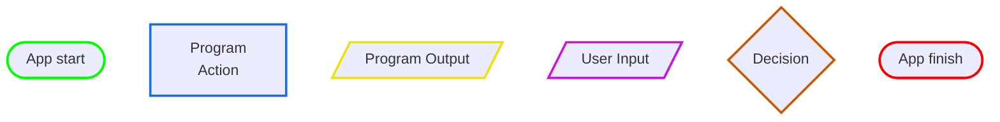

# Monte Carlo Pi Simulation

This is a program that estimates the value of π by using randomly plotted points.  
(Technically, these plots are not truly random but _pseudorandom_. An important distinction.)

The program starts by greeting the user with a title and a prompt to enter a number of points.  
A user may enter as many points as they want.

Once the number of points are assigned, the program configures a GUI frame and engages the following process:

1.) Begin a Java swing timer.  
2.) Generate two random values within the display area of the GUI and create a coordinate (x,y).  
3.) Save the coordinate in an ArrayList.  
4.) Paint the point in the GUI using the last pair of coordinates in the ArrayList.

Once all points have been painted, it then:

5.) Goes through the ArrayList, one coordinate set at a time, and checks if it's found inside or outside the circle.  
6.) Generates an estimate of π with the following calculation:

$$ π = 4 \cdot \dfrac{\text{Number of points inside the circle}}{{\text{Total number of points}}} $$

## Design Diagram

```mermaid

flowchart LR

%% Start %%
    start(["Start"]):::start
%% End %% 
    finish(["Finish"]):::finish
%% Actions %%
    A1["Generate \n random (x,y)"]:::action
    A2["Add (x,y) \n &nbsp to ArrayList &nbsp"]:::action
    A3["Check point \n &nbsp in ArrayList &nbsp"]:::action
    A4["&nbsp Count it &nbsp"]:::action
    A5["Estimate π \n &nbsp using count &nbsp"]:::action
%% Input %%
    I1[/"&nbsp User enters\n  points &nbsp"/]:::input
%% Output %%
    O1[/"&nbsp Display request \n for points"/]:::output
    O2[/" &nbsp Paint (x,y) \n in JFrame &nbsp"/]:::output
    O3[/" &nbsp Display \n estimate &nbsp"/]:::output
%% Decisions %%
    D1{"Is input \n valid?"}:::decision
    D2{"Paint more\n(x,y)?"}:::decision
    D3{"Is (x,y) \n in circle?"}:::decision
    D4{"Any points \n left in \n ArrayList?"}:::decision

%% Links %%
    start --> O1
    O1 --> I1
    I1 --> D1
    D1 -.-> |<b> &nbsp No &nbsp|I1
    D1 --> |<b> &nbsp Yes &nbsp|A1
    D4 --> A5
    A5 --> O3
    O3 --> finish

subgraph Point Generation Loop
    D2 -.-> |<b> &nbsp  Yes &nbsp|A1
    A1 --> A2
    A2 --> O2
    O2 --> D2
end

subgraph Point Counting Loop
    D2 --> |<b> &nbsp No &nbsp|A3
    A3 --> D3
    D3 --> |<b> &nbsp Yes &nbsp|A4
    A4 --> D4
    D4 -.-> |<b> &nbsp No &nbsp|D3
end

%% Class Colors %%
    classDef start stroke: #0f0, stroke-width: 2.5px;
    classDef finish stroke: #f00, stroke-width: 2.5px;
    classDef decision stroke: #cc5500, stroke-width: 2.5px;
    classDef action stroke: #196de3, stroke-width: 2.5px;
    classDef input stroke: #ca14de, stroke-width: 2.5px;
    classDef output stroke: #ede205, stroke-width: 2.5px;
    classDef empty width: 0px, height: 0px;
    

```

## Diagram Legend

 

## Some Future Ideas for Improvement

### **Add text to JFrame indicating approximation value**

Rather than displaying the estimation result in the console, it would be cool to see the estimation change in
real-time.  
This could be achieved by adding a text line in the JFrame window that updates every time repaint occurs.
(Maybe at the bottom?)

 

### **Add secondary JFrame showing xy plot**

Another great visual would be a secondary JFrame that plots the estimation value as the number of points increases.  
This would give the user a sense of how the number of points directly influences the estimation outcome.

 

### **Improve the GUI paint implementation**

Currently, when the first point is painted, it gets completely erased and doesn't persist in the plot.  
This requires the program to add an extra point onto the amount requested by the user and ignore the first element
in the ArrayList. While it works, it isn't exactly ideal and could probably be configured better.

 

### **Add point progress timer**

When a user enters a _very large_ number of points, the GUI will fill out every point in the square long before
the simulation is finished. This could lead to a long wait without any indication to the user.  
Something like "Drawing point x / total points" that's updated in real-time would be nice. 